<h1>:computer: Network Deployment  </h1>
The Network Deployment project, completed in the ITE 253 Network Management II course, is a comprehensive network infrastructure implemented using a Dell PowerEdge R6515 Rack Server. The project spans from initial setup to configurations, including <b> efficient IP management, DNS setup, enhancing network reliability with a secondary domain controller, DHCP, and integrating Active Directory </b>. This approach embodies a holistic strategy for creating a secure, scalable, efficient network environment.

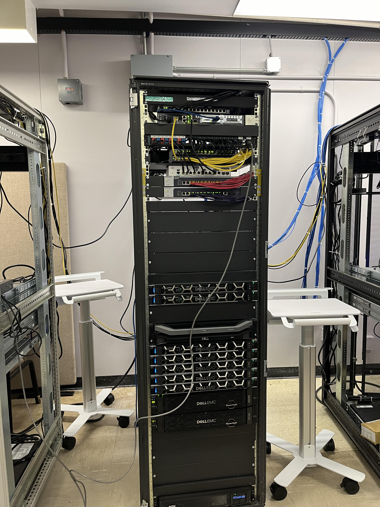

_Figure 1: Server rack with several integrated Dell PowerEdges_ 


---
## Table of Contents

- [Fresh Install](#fresh-install)
  - [ Hardware Utilized ](#-hardware-utilized-)
  - [ Steps to Create a Bootable USB ](#-steps-to-create-a-bootable-usb-)
  - [Steps to Install Standard Evaluation (Desktop Experience)](#steps-to-install-standard-evaluation-desktop-experience)
  - [ Driver Downloads ](#-driver-downloads-)
  - [ Benefits and Drawbacks of Using Windows Server ](#-benefits-and-drawbacks-of-using-windows-server-)
- [Static Network Configuration](#static-network-configuration)
  - [Setting Static IP Configuration](#setting-static-ip-configuration)
  - [Configuration Table](#configuration-table)
  - [Directions for Configuration](#directions-for-configuration)
- [DNS](#dns)
  - [Purpose of DNS](#purpose-of-dns)
  - [Setting up DNS](#setting-up-dns)
  - [How to Create Zones](#how-to-create-zones)
  - [Forward vs Reverse Lookup Zones](#forward-vs-reverse-lookup-zones)
  - [Start of Authority (SOA) and Name Server (NS) records](#start-of-authority-soa-and-name-server-ns-records)
  - [Host (A) and Pointer (PTR) records](#host-a-and-pointer-ptr-records)
- [DHCP](#dhcp)
  - [Introduction](#introduction)
  - [DHCP Scope Table](#dhcp-scope-table)
  - [Exclusions and Reservations](#exclusions-and-reservations)
  - [What is a Subnet Mask?](#what-is-a-subnet-mask)
  - [IP Address Range](#ip-address-range)
  - [Visual Representation of the IP Range](#visual-representation-of-the-ip-range)
  - [Setting Up DHCP Failover](#setting-up-dhcp-failover)
- [Active Directory](#active-directory)
  - [What is Active Directory?](#what-is-active-directory)
  - [Initial Configuration](#initial-configuration)
  - [Joining NY-DC2 to the Domain ny.contoso.com](#joining-ny-dc2-to-the-domain-nycontosocom)
  - [Why Install Active Directory First?](#why-install-active-directory-first)
  - [Installing Remote Server Administration Tools (RSAT) on Windows 10](#installing-remote-server-administration-tools-rsat-on-windows-10)
  - [Active Directory Identity Features](#active-directory-identity-features)
  - [Adding Users to Domain Admins in Active Directory](#adding-users-to-domain-admins-in-active-directory)
  - [Creating a J: Drive File Share on NY-DC1](#creating-a-j-drive-file-share-on-ny-dc1)
  - [Adding Bulk Users to Organizational Units](#adding-bulk-users-to-organizational-units)
  - [Creating a File Share for Bulk Users](#creating-a-file-share-for-bulk-users)
  - [Automating Drive Mapping on User Login](#automating-drive-mapping-on-user-login)
  - [Enabling and Configuring Disk Quotas](#enabling-and-configuring-disk-quotas)


---

## Fresh Install
This section provides detailed guidelines for a fresh installation on a Dell PowerEdge R6515 Rack Server, highlighting hardware specifications, the benefits and drawbacks of using Windows Server, and a step-by-step guide to creating a bootable USB. We also include links for downloading the necessary files.

### <ins> Hardware Utilized </ins>

**Model:** PowerEdge R6515 Rack Server

**Specifications:**
- **Processor:** AMD EPYC 7002 and 7003 series processors up to 64 cores
- **Memory:** Supports up to 2TB using 16 LRDIMM slots
- **Storage:** Flexible storage options with up to 10 x 2.5" SAS/SATA/NVMe options available
- **Management:** Integrated Dell Remote Access Controller (iDRAC) with Lifecycle Controller for advanced management

This server is designed for data centers needing an efficient and secure platform to handle demanding workloads. It offers a balance of performance, capacity, and manageability.

[Back to Table of Contents](#table-of-contents)

---

### <ins> Steps to Create a Bootable USB </ins>

1. **Download the ISO File:** Obtain the Windows Server 2022 ISO file from Microsoft. [Microsoft's Windows Server 2022 page](https://info.microsoft.com/ww-landing-windows-server-2022.html)
2. **Prepare USB Drive:** Ensure the USB drive has at least 8GB of storage and is formatted to FAT32 (detailed below)
3. **Use Rufus or a Similar Tool:** Download and run Rufus or another bootable USB creation tool. [Rufus.exe download](https://rufus.ie/en/)
4. **Configure Rufus:**
   - **Device:** Select your USB drive
   - **Boot selection:** Click SELECT and browse to your downloaded ISO file
   - **Partition scheme:** Choose GPT for UEFI firmware
   - **File system:** Select NTFS
   - **Volume label:** Name your drive as desired
   - **Click START and wait for the process to complete**

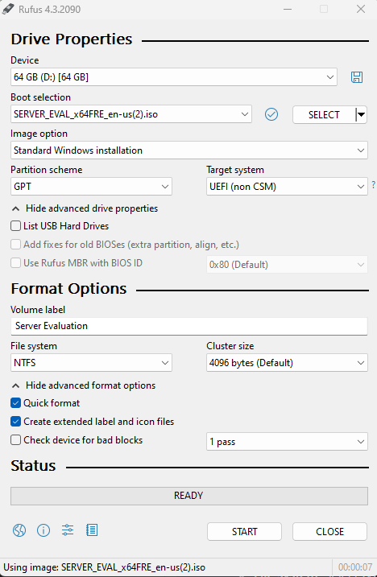

_Figure 2: Using Rufus to prepare USB Drive_ 

[Back to Table of Contents](#table-of-contents)

---

### <ins>Steps to Install Standard Evaluation (Desktop Experience)</ins>

Installing the Standard Evaluation with Desktop Experience for Windows Server involves a step-by-step process to ensure a smooth setup and configuration of a graphical user interface (GUI) environment. This version is ideal for those who prefer a graphical management interface over command-line tools.

1. **Start the Installation**: Boot your server from the installation media. On the "Windows Setup" page, select your language, time, currency, and input preferences, then click "Next".

2. **Install Now**: Click the "Install now" button to start the installation process.

3. **Select the Operating System**: Choose "Windows Server Standard Evaluation (Desktop Experience)" from the list of options. This option includes the Windows graphical environment.

4. **Accept the License Terms**: Check the box to accept the license terms and click "Next".

5. **Choose Installation Type**: Select "Custom: Install Windows only (advanced)" for a fresh installation.

6. **Select the Drive**: Choose the drive where you want to install Windows and click "Next". If needed, you can also format or partition your drive at this stage.

7. **Wait for Installation**: The installation process will begin. This will take some time and your computer may restart several times.

8. **Set Up User Accounts and Settings**: After installation, follow the prompts to configure your server, including setting up a password for the Administrator account, network settings, and any additional preferences.

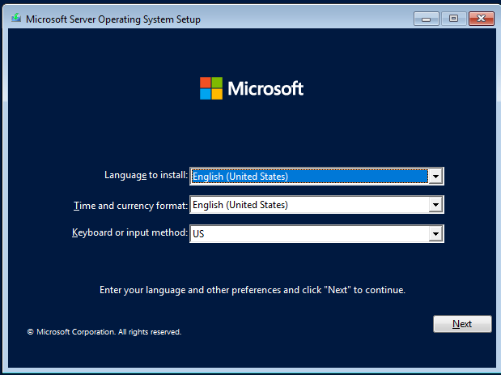 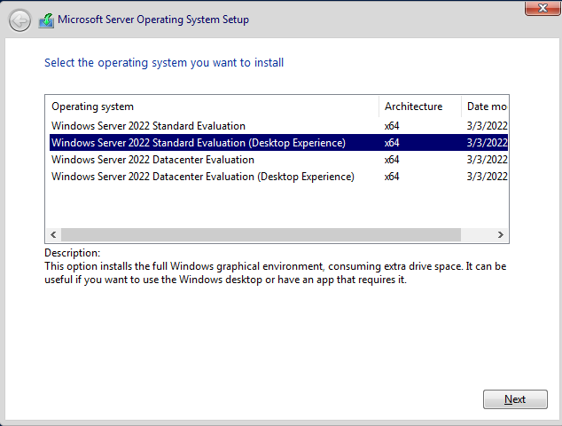 
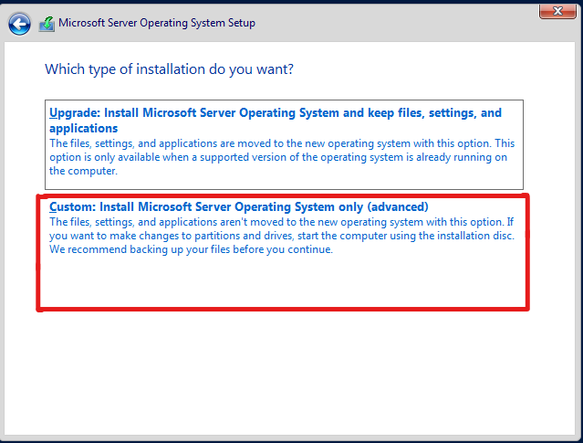 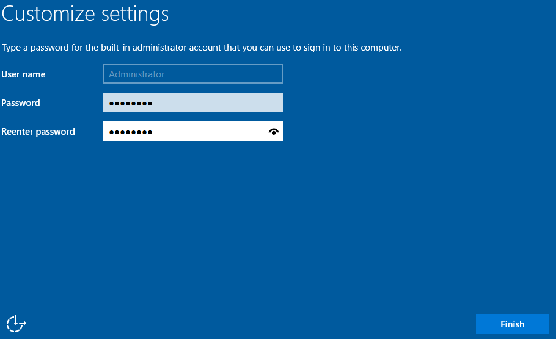

_Figure 3: Completing the Installation Process_

[Back to Table of Contents](#table-of-contents)

---

### <ins> Driver Downloads </ins>

For optimal performance and compatibility, ensure you have the latest drivers for your PowerEdge R6515 Rack Server. You can find and download the necessary drivers from Dell's official support page: [PowerEdge R6515 Drivers Download](https://www.dell.com/support/home/en-us/product-support/product/poweredge-r6515/drivers).

Remember, a successful installation not only relies on following these steps carefully but also on understanding the specifics of your hardware and software environment. Always refer to the official documentation for the most accurate and up-to-date information.

[Back to Table of Contents](#table-of-contents)

---

### <ins> Benefits and Drawbacks of Using Windows Server </ins>

**Benefits:**
- **Integrated Management Tools:** Windows Server provides powerful management tools such as Windows Admin Center and PowerShell, simplifying server administration.
- **Security:** Enhanced security features like Windows Defender Advanced Threat Protection and encrypted virtual machines help protect against modern security threats.
- **Hybrid Capabilities:** Seamless hybrid operations with Azure, including Azure Arc for managing Windows Server deployments across hybrid environments.

**Drawbacks:**
- **Cost:** Windows Server licensing can be expensive, especially for organizations with multiple servers.
- **Resource Intensity:** It may require more resources (CPU, RAM) compared to some lightweight Linux distributions, potentially impacting server efficiency.
- **Compatibility:** Certain applications, especially open-source ones, may have compatibility issues or may not be optimized for Windows Server environments.

[Back to Table of Contents](#table-of-contents)

---

## Static Network Configuration

The purpose of setting static network configurations in a network environment is to ensure that important devices such as servers, printers, and network infrastructure devices have consistent IP addresses. This consistency is crucial for network reliability, security, and ease of management, preventing issues like IP conflicts and making devices easily identifiable by their fixed IP addresses.

### <ins>Setting Static IP Configuration</ins>

1. **IP Address**: This is the unique address assigned to each device on the network, allowing it to communicate with other devices. 
2. **Subnet Mask**: Defines the network portion and the host portion of the IP address, helping devices determine if other devices are on the same network.
3. **Default Gateway**: The IP address of the router or device that connects the local network to other networks, allowing devices to communicate outside their local network.
4. **DNS**: The Domain Name System (DNS) servers translate human-friendly domain names to IP addresses, facilitating internet browsing by allowing devices to find websites using domain names instead of IP addresses. 

[Back to Table of Contents](#table-of-contents)

---

### <ins>Configuration Table</ins>
This section of the documentation provides a detailed breakdown of the network configuration for our deployment. The table below outlines the necessary parameters for setting up each device within our network, including domain controllers and network interfaces.

**Name**: Indicates the identifier of the domain controller being configured. Each domain controller has a unique name to distinguish its role and location within the network, such as NY-DC1 for the first domain controller in the "New York" office.

**Interface**: Refers to the specific network interface on a device. Devices may have multiple interfaces (e.g., Net1, Net2), each configured for different network segments or purposes.
| Name | Interface | IP Address | Network | Subnet Mask | Gateway Address |
| --- | --- | --- | --- | --- | --- |
| NY-DC1 | Net1 | 172.16.16.2 | 172.16.16.0 | 255.255.240.0 | 172.16.16.1 | 
| NY-DC1  | Net2 | 172.16.16.3 | 172.16.16.0 | 255.255.240.0 | 172.16.16.1 | 
| NY-DC2 | Net1 | 172.16.16.4 | 172.16.16.0 | 255.255.240.0 | 172.16.16.1 | 
| NY-DC2 | Net2 | 172.16.16.5 | 172.16.16.0 | 255.255.240.0 | 172.16.16.1 | 
| UPS  | NET | 172.16.16.6 | 172.16.16.0 | 255.255.240.0 | 172.16.16.1 | 


### <ins>Directions for Configuration</ins>

1. **Accessing Network Settings**: Navigate to the Control Panel, find the Network and Sharing Center, and click on 'Change adapter settings'. Right-click on the network connection you wish to configure, and select 'Properties'.

2. **Configuring IP Address and Subnet Mask**:
   - Within the Networking tab of the selected connection, scroll down to 'Internet Protocol Version 4 (TCP/IPv4)' and click on 'Properties'
   - Select 'Use the following IP address' and enter your chosen IP address and Subnet Mask

3. **Setting Default Gateway and DNS**:
   - In the same window, enter the Default Gateway address provided by your network administrator
   - Below the Default Gateway, select 'Use the following DNS server addresses' and input the preferred and alternate DNS server addresses

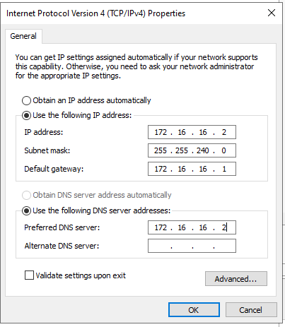

_Figure 4: Configuring Static Address for NY-DC1_

[Back to Table of Contents](#table-of-contents)

---

## DNS

The Domain Name System (DNS) plays a crucial role in how users interact with the internet, translating human-readable domain names into machine-readable IP addresses. This process allows users to access websites using familiar domain names instead of numeric IP addresses.

### <ins>Purpose of DNS</ins>

DNS simplifies the process of accessing internet resources by allowing users to use easy-to-remember domain names. This system is akin to a phonebook for the internet, converting domain names (like `www.example.com`) into IP addresses that computers use to identify each other on the network.

### <ins>Setting up DNS</ins>

Setting up a DNS server involves installing DNS server software on a server, configuring basic settings, and ensuring it responds to DNS queries.

1. **Installation**: In Server Manager, use the _Add Roles and Features Wizard_ to add the DNS role to your server

2. **Basic Configuration**: Initially, configure your DNS server to answer queries for your domain. This includes specifying the primary domain for which the server will be authoritative.

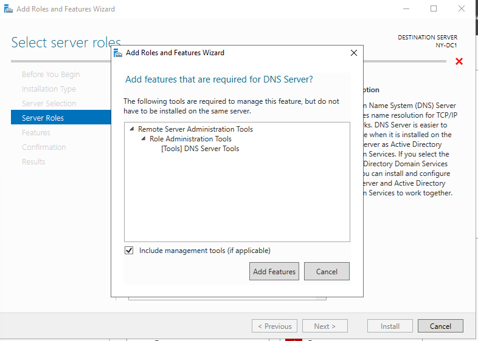

*Figure 5: DNS Server Installation*

[Back to Table of Contents](#table-of-contents)

---

### <ins>How to Create Zones</ins>

DNS zones are used to manage domain names and their corresponding IP addresses within a particular segment of the DNS namespace.

1. **Primary Zone**: Create a primary zone to hold the authoritative DNS records for a domain. This can be done through the DNS server's management console or configuration files.

2. **Secondary Zone**: Optionally, set up a secondary zone for redundancy. This zone will be a read-only copy of the primary zone data.

3. **Directions**:
   - Navigate to your DNS server's management interface
   - Choose to create a new zone, selecting between primary or secondary
   - Enter the domain name for the zone and configure any additional settings such as zone file location or replication to other servers

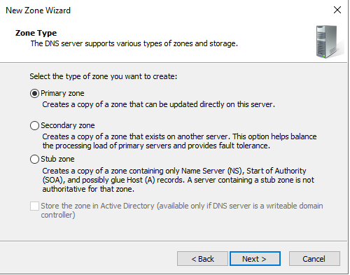 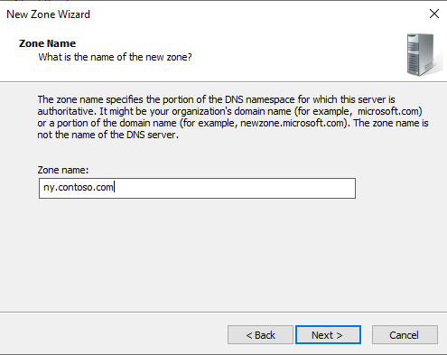 

*Figure 6: Creating a DNS Zone*

[Back to Table of Contents](#table-of-contents)

---

### <ins>Forward vs Reverse Lookup Zones</ins>

- **Forward Lookup Zones**: Translate domain names into IP addresses. This is the most common type of DNS query.
  
- **Reverse Lookup Zones**: Translate IP addresses back into domain names. These zones are helpful for logging, auditing, and troubleshooting purposes.

Creating both types of zones ensures that DNS can handle both forward and reverse queries, providing comprehensive domain name resolution services.

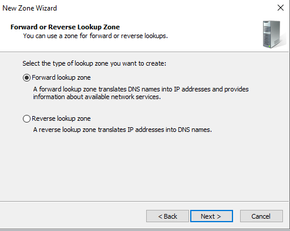 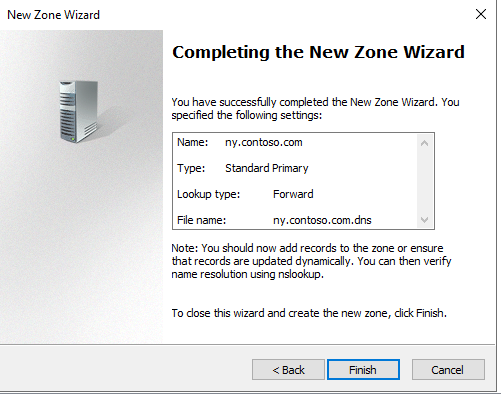 
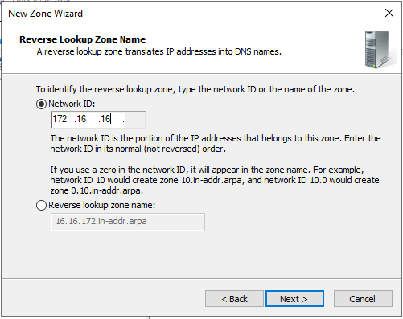 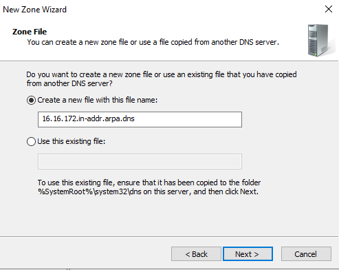 

*Figure 7: Forward and Reverse Lookup Zones*

[Back to Table of Contents](#table-of-contents)

---

### <ins>Start of Authority (SOA) and Name Server (NS) records</ins>

The Start of Authority (SOA) and Name Server (NS) records are fundamental components of the Domain Name System (DNS) which are crucial in the management and operation of DNS zones. Here's a brief overview of each:

**SOA Record:**
The Start of Authority (SOA) record is essential in any DNS zone. It defines the global parameters for the zone, including the primary DNS server responsible for the zone, the contact details for the domain administrator, the zone's serial number, and several timers relating to refreshing the zone:
- **Primary DNS Server:** The server that holds the definitive versions of all records in the zone
- **Administrator Contact:** An email address (in a slightly altered format) for the zone's administrator
- **Serial Number:** A timestamp that changes whenever the zone file is updated
- **Refresh Time:** How often secondary DNS servers should refresh their copies of the zone
- **Retry Time:** How often the secondary should retry after a failed refresh
- **Expire Time:** How long the secondary should wait before discarding the zone data if it can’t reach the primary
- **Minimum TTL:** The minimum amount of time that records should be cached by other DNS servers

**NS Records:**
Name Server records identify the DNS servers responsible for maintaining a DNS zone. An NS record:
- Points to an authoritative DNS server for the domain. **Ensure that the specified server's IP address is correctly resolved to prevent DNS resolution errors.**
- Helps in delegating DNS zones to secondary DNS servers, enhancing domain resolution redundancy and efficiency. Multiple NS records can be used for robustness, distributing the DNS query load and providing backup in case one server fails.


[Back to Table of Contents](#table-of-contents)

---

### <ins>Host (A) and Pointer (PTR) records</ins>
Host (A) and Pointer (PTR) records play crucial roles in the DNS ecosystem, facilitating the resolution of domain names to IP addresses and vice versa. Here’s a detailed look at each type of record:

**A Records:**
- **Purpose:** A (Address) Records are used to map hostnames to IPv4 addresses, allowing users to access resources by domain names instead of IP addresses.
- **Usage:** Essential for any domain that needs to be associated with a server or a specific IP address. For example, if you have a website `example.com`, you would use an A record to point it to the server's IP address.

**PTR Records:**
- **Purpose:** Pointer (PTR) records, often referred to as reverse DNS records, map IP addresses back to hostnames. They are the opposite of A records.
- **Usage:** Primarily used for logging or network troubleshooting purposes. They help verify IP addresses against hostnames to ensure they are not spoofed.
- **Configuration Note:** PTR records are essential in scenarios where reverse DNS lookup is required, such as email server verification. Ensuring accurate PTR records can help reduce the likelihood of emails being marked as spam.

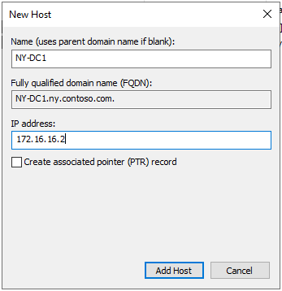 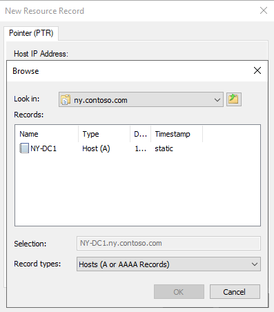 

*Figure 8: Host (A) and PTR records*

[Back to Table of Contents](#table-of-contents)

---
  
## DHCP
### Introduction

This document outlines the setup of the Dynamic Host Configuration Protocol (DHCP) for automating the management of IP addresses within an organization. It specifies how to handle IP reservations and exclusions for critical infrastructure to ensure reliable and efficient network operations.

### DHCP Scope Table

The DHCP scope table lists the IP ranges available for DHCP assignments in various parts of the organization:

| Use       | Purpose/Location | Network       | Range Start   | Range End     | Broadcast     |
| --------- | ---------------- | ------------- | ------------- | ------------- | ------------- |
| NY Office | Main Office      | 172.16.16.0   | 172.16.16.1   | 172.16.31.254 | 172.16.31.255 |
|           | Branch 1         | 172.16.32.0   | 172.16.32.1   | 172.16.47.254 | 172.16.47.255 |
|           | Branch 2         | 172.16.48.0   | 172.16.48.1   | 172.16.63.254 | 172.16.63.255 |

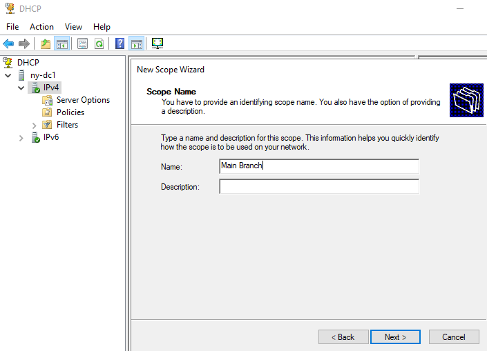 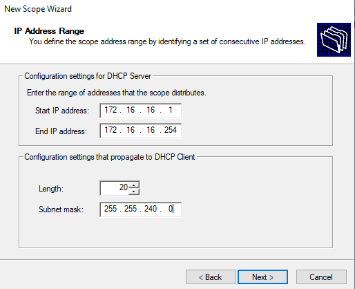 
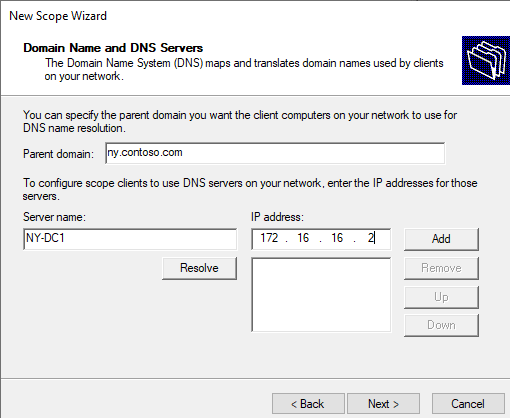 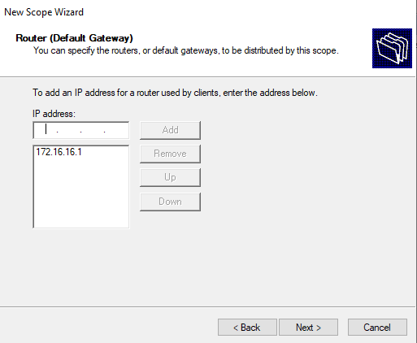 

*Figure 9: DHCP Configurations for NY-DC1*

[Back to Table of Contents](#table-of-contents)

---

### Exclusions and Reservations

For the Main Office (`172.16.16.0/20`), specific IP addresses need to be reserved for critical servers and devices, and additional IPs should be excluded for future growth:

- **Exclusions:**
  - Exclude IP addresses `172.16.16.1` to `172.16.16.16` from DHCP assignment. This range is reserved to prevent IP conflicts with essential network infrastructure and to allow for future static IP needs.

- **Reservations:**
  - **NY-DC1 Net1**: Reserve `172.16.16.2` for the server's Net1 interface
  - **NY-DC1 Net2**: Reserve `172.16.16.3` for the server's Net2 interface
  - **NY-DC2 Net1**: Reserve `172.16.16.4` for the server's Net1 interface
  - **NY-DC2 Net2**: Reserve `172.16.16.5` for the server's Net2 interface
  - **UPS NET**: Reserve `172.16.16.6` for the Uninterruptible Power Supply's network interface

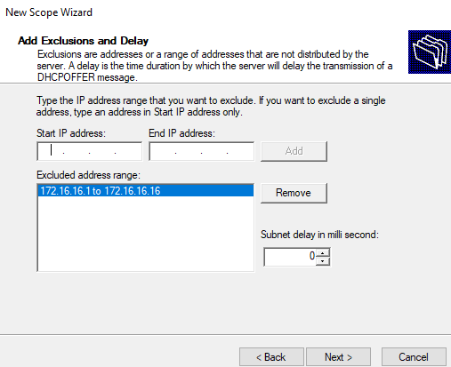 

*Figure 10: Setting DHCp exclusions for NY-DC1*

[Back to Table of Contents](#table-of-contents)

---

### What is a Subnet Mask?

A subnet mask differentiates the network portion of an IP address from the host portion. In the case of a `/20` subnet mask:
- The first 20 bits are designated for the network part.
- The remaining 12 bits are designated for the host part.
  
**Subnet Mask**: `255.255.240.0`

**Binary Form**: `11111111.11111111.11110000.00000000`

### IP Address Range

The subnet `172.16.16.0/20` provides a specific range of IP addresses:

1. **Network Address**: `172.16.16.0`
   - This is the identifier for the subnet and is not assigned to any device.

2. **Usable IP Range**:
   - Starts at: `172.16.16.1`
   - Ends at: `172.16.31.254`
   - These addresses are available for devices within the network.

3. **Broadcast Address**: `172.16.31.255`
   - This address is used to send broadcast messages to all devices within the subnet.

### Visual Representation of the IP Range

- **Network Start**: `172.16.16.0` (Network identifier)
- **First Usable IP**: `172.16.16.1` (First IP address available for devices)
- **Last Usable IP**: `172.16.31.254` (Last IP address available for devices before the broadcast address)
- **Broadcast IP**: `172.16.31.255` (Used for network-wide communications)

[Back to Table of Contents](#table-of-contents)

---

### Setting Up DHCP Failover

To ensure high availability, set up DHCP failover with the following steps:

1. **Install DHCP Role:** Both `NY-DC1` and `NY-DC2` should have the DHCP role installed
2. **Configure Identical Scopes:** Ensure that both servers have matching DHCP scope settings, including the exclusions and reservations outlined above
3. **Enable Failover:** Select "Configure Failover" for the Main Office scope from the DHCP console
4. **Specify Partner Server:** Input the name or IP address of the partner DHCP server
5. **Choose Failover Mode:**
   - *Load Balance:* Distribute client requests evenly between the two servers
   - *Hot Standby:* One server acts as the primary while the other serves as a backup
6. **Set Failover Parameters:** Define the relationship name, MCLT, and load balance settings
7. **Activate and Verify:** Finalize the setup and ensure both servers are synchronized and functioning properly

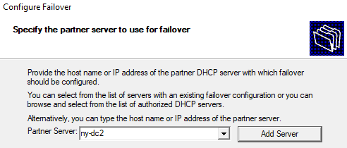

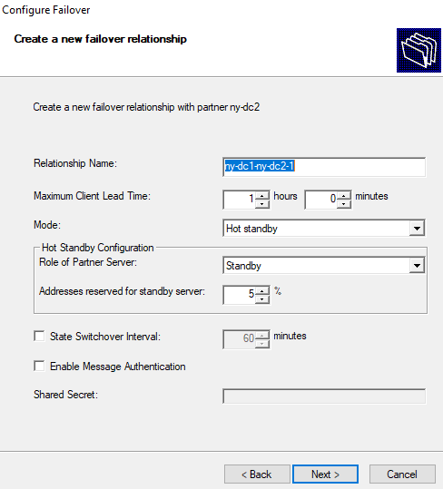

*Figure 11: DHCP failover configuration*

[Back to Table of Contents](#table-of-contents)

---

## Active Directory

### What is Active Directory?

Active Directory (AD) is a directory service developed by Microsoft that facilitates the management of network resources. It enables administrators to manage permissions and access to network resources, including computers, users, printers, and files within a domain. AD uses a structured data store as the basis for a logical, hierarchical organization of directory information. This store manages information about a network's users and their privileges, which helps in administering security.

### Initial Configuration

1. **Prepare the Server:**
   - Ensure that the server named `NY-DC1` meets the hardware requirements for Windows Server
   - Install the latest version of Windows Server on `NY-DC1`
   - Configure a static IP address on the server to ensure consistent network communications

2. **Install the Active Directory Domain Services Role:**
   - Open the 'Server Manager' dashboard
   - Navigate to **Manage** > **Add Roles and Features**
   - Proceed through the wizard until you reach the **Roles** section
   - Check **Active Directory Domain Services** and any additional features required for your deployment
   - Click **Next** and **Install** to begin the installation of the AD DS role

3. **Configure Active Directory:**
   - After installation, launch the **AD DS Deployment Wizard** from the Server Manager
   - Choose to **Create a new forest** and type your root domain name (e.g., `ny.contoso.com`)
   - Follow the prompts to configure the Domain Controller options, DNS settings, and database, log, and SYSVOL paths
   - Set a Directory Services Restore Mode (DSRM) password

4. **Verify the Installation:**
   - Once the installation is complete, use the `dcdiag` command in the command prompt to verify the Active Directory installation
   - Run `nslookup` to ensure that DNS is configured properly for your domain controller

5. **Post-Configuration Tasks:**
   - Create organizational units (OUs), users, and groups as per your organizational needs
   - Configure Group Policies for security settings and user environments
   - Back up your AD configuration regularly to avoid data loss

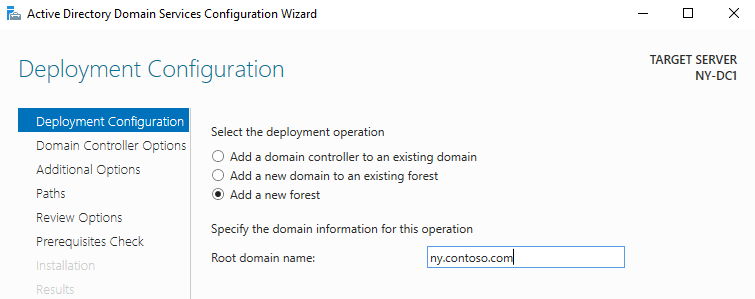 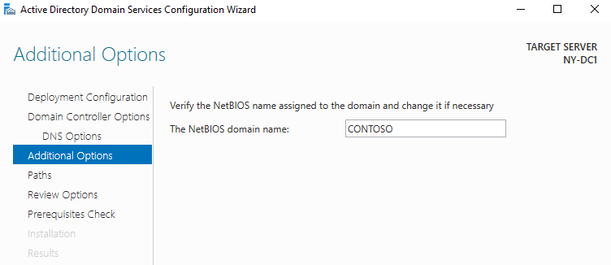 
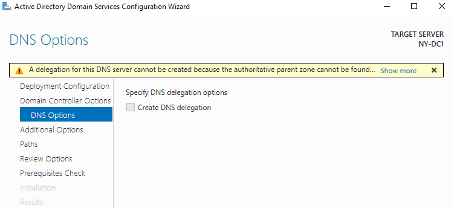 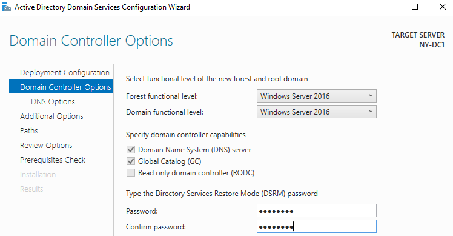

*Figure 12: Active Directory configuration*

[Back to Table of Contents](#table-of-contents)

---

### Joining NY-DC2 to the Domain ny.contoso.com

*Joining a second domain controller to an existing domain can enhance the reliability and availability of your network's Active Directory services. Here is how to add `NY-DC2` as a domain controller in the domain `ny.contoso.com`*

<ins> Before beginning the process ensure that: </ins>

- The server `NY-DC2` is installed with Windows Server and configured with a static IP address
- The primary DNS server for `NY-DC2` is set to the IP address of `NY-DC1`. This setup is crucial as `NY-DC2` can only recognize the domain `ny.contoso.com` if it can properly resolve names through `NY-DC1`, the main DNS server already part of the domain.

1. **Join `NY-DC2` to the Domain**:
   - If not already done, join `NY-DC2` to `ny.contoso.com` as a member server via the "Computer Name/Domain Changes" in System Properties
   - Provide administrative domain credentials when prompted
   - **LAB Credentials ( Username: administrator | Password: Pa55w.rd )**

2. **Install the Active Directory Domain Services Role**:
   - Open **Server Manager** on `NY-DC2`
   - Click on **Add roles and features** and proceed through the wizard
   - Select the **Active Directory Domain Services** role, and install it

3. **Promote the Server to a Domain Controller**:
   - When logging in use **LAB Credentials (Username: CONTOSO\\administrator | Password: Pa55w.rd)**
   - After installing the role, click on the notification flag in Server Manager and select **Promote this server to a domain controller**
   - Choose **Add a domain controller to an existing domain**, enter the domain name (`ny.contoso.com`), and provide administrative credentials
   - Follow the wizard to configure the Domain Controller options, DNS settings, and additional options like the location of the AD DS database, log files, and SYSVOL folder
   - Complete the wizard to start the promotion process

4. **Verify Domain Controller Operation**:
   - Check the operation of `NY-DC2` as a domain controller using tools like **Active Directory Sites and Services** and `repadmin` for replication health

5. **Configure DNS Redundancy**:
   - After promoting `NY-DC2`, ensure it hosts the DNS role, and update DNS settings on both `NY-DC1` and `NY-DC2` to refer to each other, ensuring DNS redundancy and reliability

*After promoting NY-DC2 to a domain controller and ensuring it hosts the DNS role, configure both NY-DC1 and NY-DC2 to use each other as primary and secondary DNS servers, respectively, to ensure DNS redundancy and optimal network performance within your domain.*

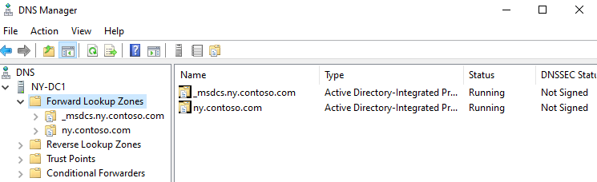

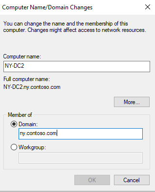 

*Figure 13: Joining second domain controller NY-DC2*

[Back to Table of Contents](#table-of-contents)

---

### Why Install Active Directory First?

**1. Dependency on DNS**
   Active Directory heavily relies on DNS to function properly. During the AD installation and when promoting a server to a domain controller, DNS settings are configured automatically. This auto-configuration ensures that all necessary DNS records, such as service records (SRV) and other essentials, are accurately created and managed.

**2. Simplification of DNS Configuration**
   By installing Active Directory first, DNS zones and records required for AD are automatically set up. This automation reduces the risk of manual errors and ensures that the DNS is configured precisely as needed for Active Directory to operate smoothly.

**3. Integration and Management**
   Integrating DNS with Active Directory during the initial setup enables dynamic updates to DNS records by AD services. This integration allows for both DNS and AD to be managed from the same console, streamlining administrative tasks and enhancing the system's manageability.

**4. Security and Permissions**
   Active Directory-integrated DNS zones benefit from AD's security features, such as secure dynamic updates. This setup allows only machines with appropriate credentials to update DNS records, enhancing the security posture against unauthorized changes.

**5. Role of DHCP in the Order of Installation**
   DHCP does not depend directly on Active Directory or DNS in the same way they depend on each other. Therefore, DHCP can be configured after AD and DNS without complications. Additionally, DHCP servers can be set to dynamically update DNS records for clients, further integrating with the already established AD and DNS setup.

[Back to Table of Contents](#table-of-contents)

---

### Installing Remote Server Administration Tools (RSAT) on Windows 10

Remote Server Administration Tools (RSAT) allow IT administrators to manage Windows Server from a remote computer running Windows 10. This guide covers the steps to download and install RSAT on this operating system.

**Requirements:**
- A PC running Windows 10
- Internet access to download the RSAT installation package
- Administrative privileges on the computer

**Steps for Windows 10:**

1. **Download RSAT:**
   - Go to the [Microsoft Download Center](https://www.microsoft.com/en-us/download/details.aspx?id=45520)
   - Select the version of RSAT that corresponds to your version of Windows 10 (updates aligned with Windows 10 build numbers)

2. **Install RSAT:**
   - Once downloaded, double-click the installation package and follow the on-screen instructions
   - After installation, no reboot is required

**Using RSAT:**
- Once RSAT is installed, you can use various tools such as Active Directory Users and Computers, DNS, DHCP, etc., from your Windows 10 workstation
- You may need to enter administrative credentials from your domain to access some of these tools depending on your network settings

**Troubleshooting:**
- If you encounter issues during installation, ensure your Windows is up to date and retry the steps
- Make sure you have administrative rights as these are required to install and manage RSAT components

[Back to Table of Contents](#table-of-contents)

---

### Active Directory Identity Features

**Organizational Units (OUs):**
- **Definition:** Organizational Units are containers used within Active Directory to organize users, groups, computers, and other organizational units. They provide a way to establish hierarchy, delegate administrative rights, and apply policy settings.
- **Usage:** OUs can be structured to mirror an organization’s functional or geographical layout, allowing for efficient management and policy application at different levels of the hierarchy.

**Security Groups:**
- **Purpose:** Security groups in Active Directory are used to collect user accounts, computer accounts, and other groups into manageable units for security administration.
- **Benefits:** Using security groups, administrators can assign permissions and rights to a group rather than to individual users, streamlining access management and ensuring consistent security policy across users and systems.

**Domain Admin Privileges:**
- **Role:** Domain Admins have elevated privileges that allow them to perform critical administrative tasks across the domain, such as setting security policies, managing user privileges, and configuring important network resources.
- **Security Concerns:** Due to their extensive access, domain admin accounts should be used sparingly, protected with multi-factor authentication, and monitored for unusual activity to prevent security breaches.

**Group Policy Objects (GPOs):**
- **Functionality:** GPOs are used to define configurations for users and computers within the domain. They control policies across a wide range of areas such as security settings, software installation, and user environment settings.
- **Implementation:** Administrators can create GPOs within the Group Policy Management Console (GPMC) and link them to OUs, domains, or sites, allowing for precise control over how policies are applied based on the structure of Active Directory.

**DNS Configuration After Joining Domain:**
- **Automatic Update:** After a server joins a domain, its DNS settings are often automatically updated to refer to the local address `127.0.0.1` as the primary DNS server. This change directs DNS queries to the DNS resolver running on the localhost, which is configured to forward queries to the domain’s DNS servers.
- **Purpose:** This configuration helps ensure that DNS queries are resolved within the local network, improving query response time and reducing external DNS traffic.

[Back to Table of Contents](#table-of-contents)

---

### Adding Users to Domain Admins in Active Directory

**Step 1: Create an Organizational Unit (OU)**
1. **Open Active Directory Users and Computers:** This can be accessed from the Administrative Tools on your server
2. **Create the OU:**
   - Right-click the domain (e.g., `ny.contoso.com`) in the tree view
   - Select `New` > `Organizational Unit`
   - Name the OU `IT` and click `OK`

**Step 2: Create a New User in the IT OU**
1. **Navigate to the IT OU:**
   - Right-click on the `IT` OU
   - Select `New` > `User`
2. **Enter User Details:**
   - Provide the first name, last name, and user logon name
   - Click `Next`
   - Set a password for the user and choose password options (e.g., user must change password at next logon)
   - Click `Next`, then `Finish` to create the user

**Step 3: Add the New User to the Domain Admins Group**
1. **Find the Newly Created User:**
   - In the `IT` OU, right-click the user you just created
   - Select `Add to a group…`
2. **Add to Domain Admins:**
   - In the `Enter the object names to select` box, type `Domain Admins`
   - Click `Check Names` to verify the group name. Once the name is underlined, click `OK`
   - This action adds the user to the Domain Admins group, granting them administrative privileges across the domain

**Step 4: Verify Group Membership**
1. **Check the User’s Properties:**
   - Double-click on the user’s account
   - Go to the `Member Of` tab to see all groups the user belongs to, ensuring `Domain Admins` is listed

**Step 5: Group Policy and Security Considerations**
- **Review Group Policy Settings:** Ensure that Group Policy settings related to Domain Admins are appropriate and secure
- **Security Best Practices:**
  - Limit the number of users in the Domain Admins group as it grants broad administrative privileges
  - Regularly audit group membership and use role-based access control to minimize security risks

*These steps streamline the process of managing user roles within an organization, allowing you to maintain tight control over administrative access and ensure compliance with security policies*

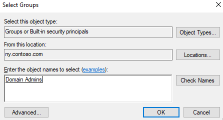 

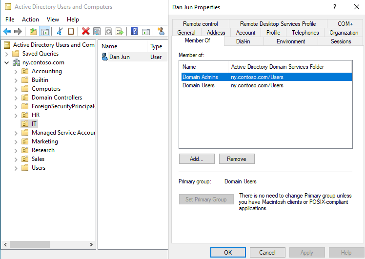 

*Figure 14: Reviewing "Domain Admins" membership*

[Back to Table of Contents](#table-of-contents)

---

### Creating a J: Drive File Share on NY-DC1

This guide walks you through the process of creating a shared J: drive and configuring a new volume on your server by shrinking an existing volume using the Server Manager on Windows Server. Creating a dedicated volume for your file share, instead of using the existing C: drive, offers several advantages that enhance performance, security, and manageability.

**Why Create a Dedicated Volume?**

1. **Performance Isolation**: Using a separate volume for shared files can help isolate disk activity from the operating system (OS) disk, which is typically the C: drive. This separation can prevent file sharing operations from affecting the performance of the server’s OS and vice versa.

2. **Security**: A dedicated volume can be secured and managed with specific security policies tailored to the needs of the shared data, independent of the security settings of the OS volume. This approach allows more granular control over who can access the data.

3. **Ease of Management**: With a dedicated volume, it is easier to manage backups, data recovery, and disk maintenance without interfering with the OS. For instance, the volume can be resized, defragmented, or scanned for errors independently of the system volume.

4. **Improved Data Organization**: Separating shared data from system data helps in organizing and locating data more efficiently. This organization can be particularly beneficial for administrative tasks and compliance with data storage policies.

5. **Enhanced Backup and Recovery**: Having a separate volume for shared data simplifies the backup process, as only the data volume can be targeted, which reduces the backup window and storage requirements. It also speeds up recovery in case of data loss, as the volume can be restored independently of the OS.

**Part 1: Shrinking a Volume to Create a New Volume**

1. **Open Disk Management**:
   - From the Server Manager, click on **Tools** and select **Computer Management**. Navigate to **Disk Management** under the Storage section.

2. **Select the Volume to Shrink**:
   - Right-click the volume you want to shrink (make sure it has enough free space) and select **Shrink Volume**

3. **Specify the Amount to Shrink**:
   - Enter the amount of space to shrink the volume by, which will determine the size of the new volume

4. **Create New Volume**:
   - Right-click on the newly created unallocated space and select **New Simple Volume**. Follow the wizard to configure and format the new volume.

5. **Assign Drive Letter**:
   - During the setup, assign the letter J: to the new volume if it is intended to be the J: drive

6. **Format the Volume**:
   - Choose a file system and perform a quick format if desired. Label the volume as necessary.

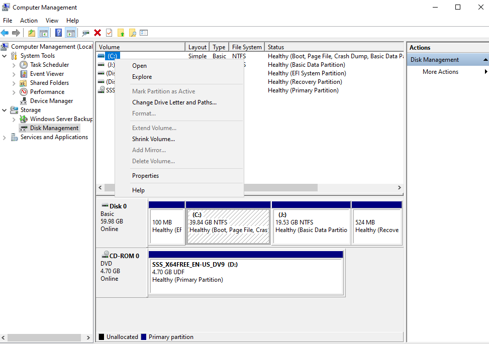
*Figure 15: Shrinking C: drive to allocate space for new J: drive*

**Part 2: Creating a J: Drive File Share**

1. **Open Server Manager**: Start by opening the Server Manager dashboard

2. **Navigate to File and Storage Services**:
   - Click on **File and Storage Services** in the left pane

3. **Access Shares Section**:
   - Within the File and Storage Services, select **Shares**

4. **Create New Share**:
   - Click on **TASKS**, and then select **New Share...**. A wizard will open to guide you through the setup.

   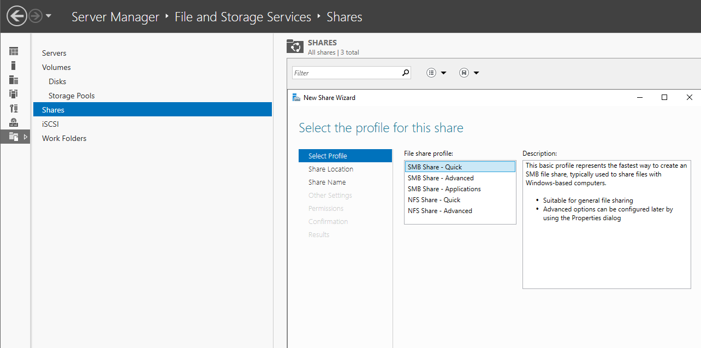
   *Figure 16: Creating SMB Share and root folder*

5. **Choose a Share Profile**:
   - Follow the wizard steps, selecting the appropriate share profile that suits your needs

6. **Specify Share Name and Path**:
   - Assign a name to your share (e.g., J Drive) and specify the local path where the share resides

7. **Configure Share Settings**:
   - Set the desired permissions and configure other settings such as access permissions

   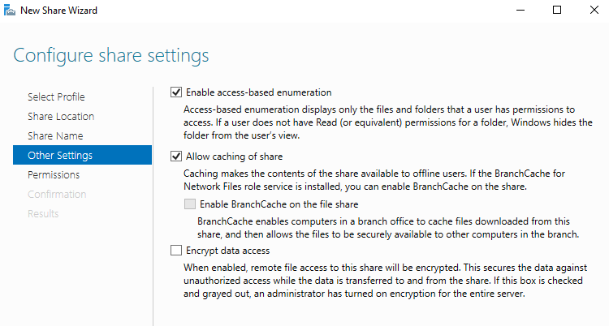

   *Figure 17: Configuration settings for the new share*

8. **Review and Create the Share**:
   - Review all settings, and click **Create** to finalize the share setup

*Once you have configured both the shared drive and the new volume, ensure all settings are correct and the systems are functioning as expected*

[Back to Table of Contents](#table-of-contents)

---


### Adding Bulk Users to Organizational Units

This section provides a guide on how to bulk-add users to Active Directory in specific Organizational Units (OUs) like Accounting, Sales, HR, IT, Research, and Marketing. Each user will also receive access to a personal file drive, designated as `J:`, pointing to a file share structured as "Shares/Users/{Username}"

**Requirements:**
- PowerShell script execution enabled on your server
- Necessary permissions to add users and modify file shares
- A CSV file named `UserList.csv` containing the user data structured with columns: FirstName, LastName, OU, Username
  
```csv
Brief glimpse into the UserList.csv

FirstName, LastName, OU, Group, Password
Lacie, English, Accounting, Accounting, Pa55w.rd
Marci, Sloan, Sales, Sales, Pa55w.rd
Joana, Applegate, HR, HR, Pa55w.rd
Rosio, Bland, IT, IT, Pa55w.rd
Janeth, Lowery, Research, Research, Pa55w.rd
Eleanor, Hannon, Marketing, Marketing, Pa55w.rd
```

**Step 1: Prepare the PowerShell Script**

**Create the PowerShell Script:**
   Open Notepad or any text editor.
   Copy and paste the following script, which creates users from a CSV file and assigns a drive mapping to their profile:

   ```powershell
# AddBulkUsers.ps1
Import-Module ActiveDirectory
$users = Import-Csv -Path "C:\Path\To\Your\UserList.csv"

foreach ($user in $users) {
    # Sanitize and create a username by concatenating FirstName and LastName
    $username = ($user.FirstName.Trim() + $user.LastName.Trim()).Replace(" ", "")

    # Ensure username is properly formed, adjust if necessary
    # Error will occur if username is over 20 characters
    if ($username.Length -gt 20) {
        $username = $username.Substring(0, 20)  
    }

    $userPrincipalName = $username + "@ny.contoso.com"
    $password = ConvertTo-SecureString $user.Password -AsPlainText -Force
    $path = "OU=" + $user.OU + ",DC=ny,DC=contoso,DC=com"

    # Create the user account
    Try {
        New-ADUser -Name $username -GivenName $user.FirstName -Surname $user.LastName `
                  -UserPrincipalName $userPrincipalName -SamAccountName $username `
                  -Path $path -AccountPassword $password -Enabled $true `
                  -ChangePasswordAtLogon $false
    }
    Catch {
        Write-Error "Failed to create user: $_"
        Continue
    }

    # Add a small delay or check if user exists before adding to group
    Start-Sleep -Seconds 2  # Delay to allow AD to update
    if ($user.Group) {
        Try {
            Add-ADGroupMember -Identity $user.Group -Members $username
        }
        Catch {
            Write-Error "Failed to add user to group: $_"
        }
    }
}


```

**Step 2: Execute the Powershell Script**

1. Run PowerShell as Administrator:
   * Right-click the PowerShell icon and select 'Run as administrator'
2. Navigate to the Script Location:
   * Use cd to change directory to where your script is saved
3. Execute the Script:
   * Type .\AddBulkUsers.ps1 (assuming your script is named AddBulkUsers.ps1)
   * Press Enter to run the script. It will read the CSV file and create each user in Active Directory, assign them to the appropriate OU, and set up their file drive.
  
[Back to Table of Contents](#table-of-contents)

---

### Creating a File Share for Bulk Users

The PowerShell script below is designed to create individual user folders within specified organizational units (OUs) in Active Directory. It sets up a network share for each user and configures the necessary permissions.

- **Root Path Setup**: The root path where user folders will be located is set to `J:\Shares\Users`
- **OU Specification**: User details are pulled from several specified OUs like Accounting, HR, IT, etc.
- **User Folder Creation**: Folders are created under the root path based on the user's `SamAccountName`
- **NTFS Permissions**: The script sets up NTFS permissions by disabling inheritance and removing existing permissions. It grants 'Modify' access to the individual user and 'Full Control' to the Administrators group.
- **SMB Share**: Each user's folder is shared on the network, making it accessible via a hidden share (`Username$`)

```powershell
#createshares.ps1
$RootPath = "J:\Shares\Users"

# Get the list of users from specific OUs
$OUs = @("OU=Accounting,DC=ny,DC=contoso,DC=com",
         "OU=HR,DC=ny,DC=contoso,DC=com",
         "OU=IT,DC=ny,DC=contoso,DC=com",
         "OU=Marketing,DC=ny,DC=contoso,DC=com",
         "OU=Research,DC=ny,DC=contoso,DC=com",
         "OU=Sales,DC=ny,DC=contoso,DC=com")

# Iterate through each OU and create folders and shares for each user
foreach ($OU in $OUs) {
    $Users = Get-ADUser -Filter * -SearchBase $OU -Properties SamAccountName
    foreach ($User in $Users) {
        $UserPath = Join-Path -Path $RootPath -ChildPath $User.SamAccountName
        if (-Not (Test-Path $UserPath)) {
            New-Item -Path $UserPath -ItemType Directory
        }

        # Set NTFS permissions
        $Acl = Get-Acl $UserPath
        $Acl.SetAccessRuleProtection($true, $false)  # Enable ACL protection, do not keep inherited rules
        $Acl.Access | ForEach-Object { $Acl.RemoveAccessRule($_) }  # Remove all existing access rules
        $AccessRule = New-Object System.Security.AccessControl.FileSystemAccessRule($User.SamAccountName, "Modify", "ContainerInherit,ObjectInherit", "None", "Allow")
        $AdminRule = New-Object System.Security.AccessControl.FileSystemAccessRule("Administrators", "FullControl", "ContainerInherit,ObjectInherit", "None", "Allow")
        $Acl.AddAccessRule($AccessRule)
        $Acl.AddAccessRule($AdminRule)
        Set-Acl -Path $UserPath -AclObject $Acl

        # Share the directory
        $ShareName = $User.SamAccountName + "$"  # Creates a hidden share
        New-SmbShare -Name $ShareName -Path $UserPath -FullAccess $User.SamAccountName
    }
}
```

[Back to Table of Contents](#table-of-contents)

---

### Automating Drive Mapping on User Login

1. Open Group Policy Management:
   - On a server that is part of your domain, open the Group Policy Management Console (GPMC). This can usually be found in the Administrative Tools folder.

2. Create a New Group Policy Object and Link to OU's (GPO):
   - Press `Window key + R` to enter gpmc.msc
   - Under Group Policy Management and under your domain `ny.contoso.com` right click on Group Policy Objects and select `new`
   - Name the new GPO something descriptive like `User Drive Mapping`
   - Drag and drop the `User Drive Mapping` GPO to OU's to **link** them together
   - Link: `Accounting` `HR` `IT` `Marketing` `Research` `Sales`

3. Edit the Group Policy Object:
   - Right-click the newly created GPO and select "Edit"
   - Navigate to User Configuration -> Preferences -> Windows Settings -> Drive Maps
   - Right-click on Drive Maps and choose New -> Mapped Drive
   - Configure the drive mapping:
      - **Action: Choose "Create"**
      - Location: **Enter \\NY-DC1\users\\%USERNAME%** This uses the environment variable %USERNAME% which the Group Policy engine processes for each user
      - Drive Letter: Select "J:"
      - Reconnect: Check this option to make the mapping persistent
      - Label as: Optionally, provide a label for the drive, like "User Drive"
      - Hide/Show this drive: Choose the desired option based on whether you want to hide or show the drive
      - Hide/Show all drives: You can choose to leave this as default

4. Refresh Group Policy on Client Computers:
   - To make the changes take effect immediately, you can force a Group Policy update on the client computers by running `gpupdate /force` on each client machine, or simply wait for the next Group Policy refresh cycle

5. Verify the Drive Mapping:
   - Have users log off and then log back on to their computers. The J drive should now map automatically based on the user's username.

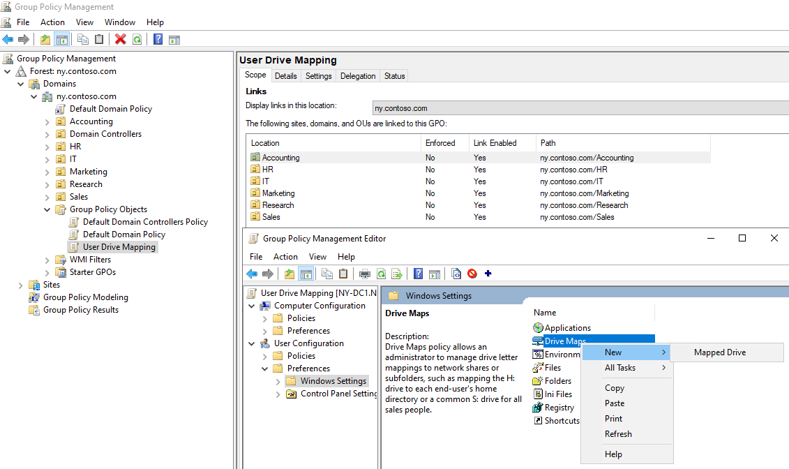
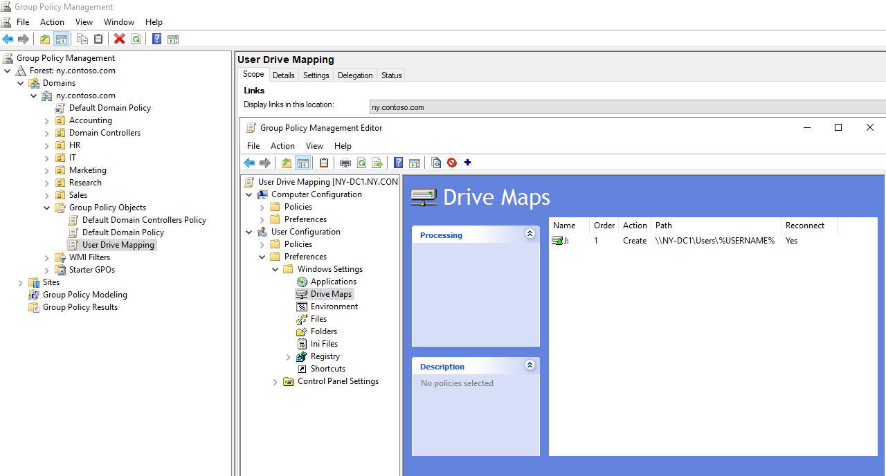

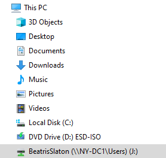

*Figure 19: Mapping User Drive Mapping GPO to OU's, make sure to refresh GPO's by running `gpupdate /force`*

[Back to Table of Contents](#table-of-contents)

---

### Enabling and Configuring Disk Quotas

**Step 1**: Access Quota Management on NY-DC1
- Navigate to the drive where user folders are hosted
- Right-click on the drive and select **Properties**
- Go to the **Quota** tab and click on **Show Quota Settings**

 

*Figure 20: Locating Quota tab after right clicking on Local Disk (J:) and selecting Properties*

**Step 2**: Enable Quota Management
- Check **Enable quota management** to activate the quota system on the drive
- Select **Deny disk space to users exceeding quota limit** to enforce quota limits

**Step 3**: Set Quota Limits
- Choose **Limit disk space to** and enter `1 GB` (for example) for the quota limit per user
- Set a **Warning level** at `500 MB` (for example) to alert users as they approach their quota limit

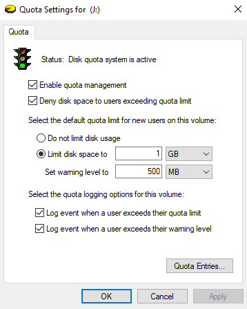 

*Figure 21: Setting quota limits for each J: drive user*

[Back to Table of Contents](#table-of-contents)

---
