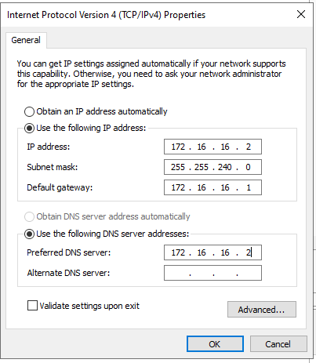
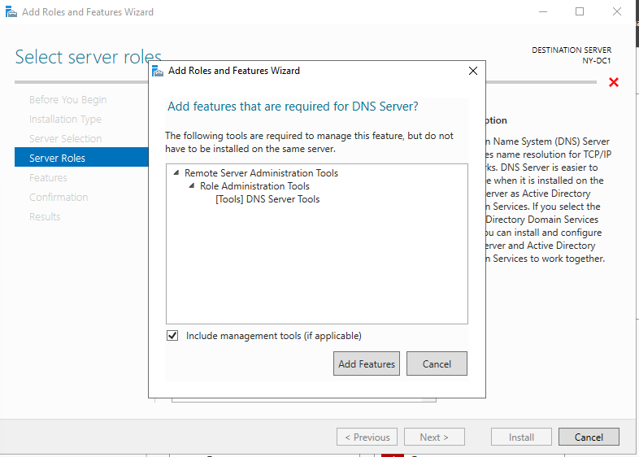
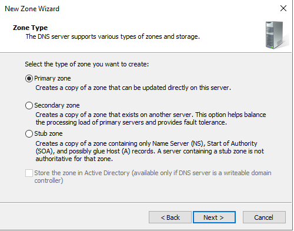
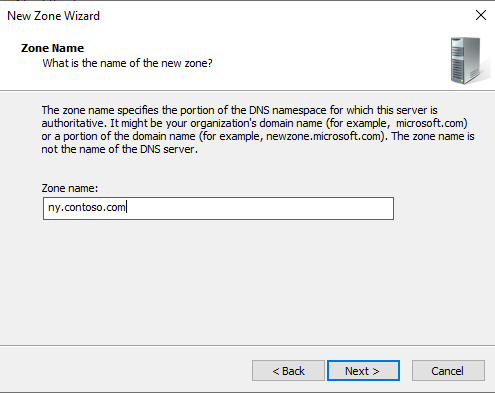
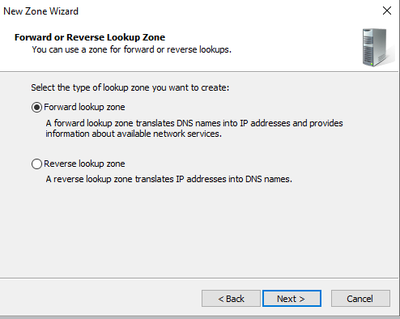
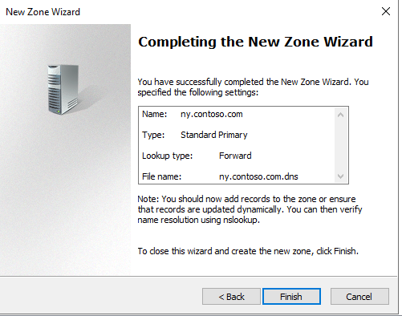
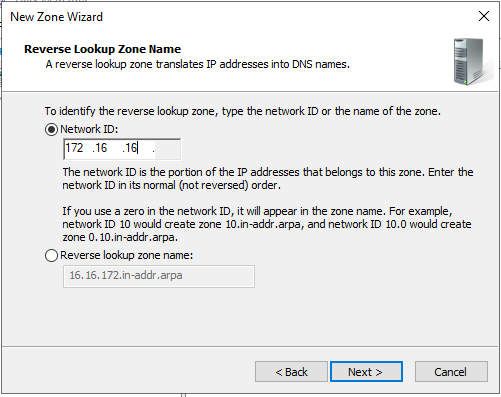
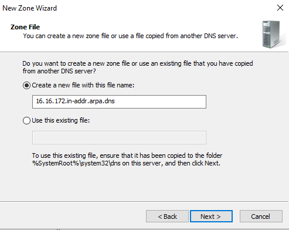
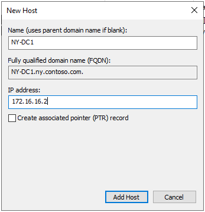
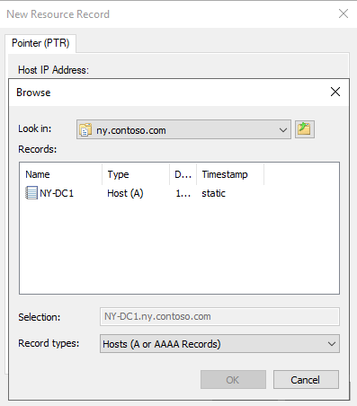

<h1>:computer: Network Deployment  </h1>
The Network Deployment project, completed in the ITE 253 Network Management II course, is a comprehensive network infrastructure implemented using a Dell PowerEdge R6515 Rack Server. The project spans from initial setup to configurations, including efficient IP management, DNS setup, enhancing network reliability with a secondary domain controller, DHCP, and integrating Active Directory. This approach embodies a holistic strategy for creating a secure, scalable, efficient network environment.

---
## Table of Contents

- [Fresh Install](#fresh-install)
  - [ Hardware Utilized ](#-hardware-utilized-)
  - [ Steps to Create a Bootable USB ](#-steps-to-create-a-bootable-usb-)
  - [Steps to Install Standard Evaluation (Desktop Experience)](#steps-to-install-standard-evaluation-desktop-experience)
  - [ Driver Downloads ](#-driver-downloads-)
  - [ Benefits and Drawbacks of Using Windows Server ](#-benefits-and-drawbacks-of-using-windows-server-)
- [Static Network Configuration](#static-network-configuration)
  - [Setting Static IP Configuration](#setting-static-ip-configuration)
  - [Configuration Table](#configuration-table)
  - [Directions for Configuration](#directions-for-configuration)
- [DNS](#dns)
  - [Purpose of DNS](#purpose-of-dns)
  - [Setting up DNS](#setting-up-dns)
  - [How to Create Zones](#how-to-create-zones)
  - [Forward vs Reverse Lookup Zones](#forward-vs-reverse-lookup-zones)
  - [Start of Authority (SOA) and Name Server (NS) records](#start-of-authority-soa-and-name-server-ns-records)
  - [Host (A) and Pointer (PTR) records](#host-a-and-pointer-ptr-records)
- [DHCP](#dhcp)
  - [Introduction](#introduction)
  - [DHCP Scope Table](#dhcp-scope-table)
  - [Exclusions and Reservations](#exclusions-and-reservations)
  - [Setting Up DHCP Failover](#setting-up-dhcp-failover)
- [Active Directory](#active-directory)
  - [Enabling Active Directory](#enabling-active-directory)

---

## Fresh Install
This section provides detailed guidelines for a fresh installation on a Dell PowerEdge R6515 Rack Server, highlighting hardware specifications, the benefits and drawbacks of using Windows Server, and a step-by-step guide to creating a bootable USB. We also include links for downloading the necessary files.

### <ins> Hardware Utilized </ins>

**Model:** PowerEdge R6515 Rack Server

**Specifications:**
- **Processor:** AMD EPYC 7002 and 7003 series processors up to 64 cores
- **Memory:** Supports up to 2TB using 16 LRDIMM slots
- **Storage:** Flexible storage options with up to 10 x 2.5" SAS/SATA/NVMe options available
- **Management:** Integrated Dell Remote Access Controller (iDRAC) with Lifecycle Controller for advanced management

This server is designed for data centers needing an efficient and secure platform to handle demanding workloads. It offers a balance of performance, capacity, and manageability.

[Back to Table of Contents](#table-of-contents)

---

### <ins> Steps to Create a Bootable USB </ins>

1. **Download the ISO File:** Obtain the Windows Server 2022 ISO file from Microsoft. [Microsoft's Windows Server 2022 page](https://info.microsoft.com/ww-landing-windows-server-2022.html)
2. **Prepare USB Drive:** Ensure the USB drive has at least 8GB of storage and is formatted to FAT32 (detailed below).
3. **Use Rufus or a Similar Tool:** Download and run Rufus or another bootable USB creation tool. [Rufus .exe download](https://rufus.ie/en/)
4. **Configure Rufus:**
   - **Device:** Select your USB drive.
   - **Boot selection:** Click SELECT and browse to your downloaded ISO file.
   - **Partition scheme:** Choose GPT for UEFI firmware.
   - **File system:** Select NTFS.
   - **Volume label:** Name your drive as desired.
   - **Click START and wait for the process to complete.**

_Figure 1: Using Rufus to prepare USB Drive_ 

[Back to Table of Contents](#table-of-contents)

---

### <ins>Steps to Install Standard Evaluation (Desktop Experience)</ins>

Installing the Standard Evaluation with Desktop Experience for Windows Server involves a step-by-step process to ensure a smooth setup and configuration of a graphical user interface (GUI) environment. This version is ideal for those who prefer a graphical management interface over command-line tools.

1. **Start the Installation**: Boot your server from the installation media. On the "Windows Setup" page, select your language, time, currency, and input preferences, then click "Next".

2. **Install Now**: Click the "Install now" button to start the installation process.

3. **Select the Operating System**: Choose "Windows Server Standard Evaluation (Desktop Experience)" from the list of options. This option includes the Windows graphical environment.

4. **Accept the License Terms**: Check the box to accept the license terms and click "Next".

5. **Choose Installation Type**: Select "Custom: Install Windows only (advanced)" for a fresh installation.

6. **Select the Drive**: Choose the drive where you want to install Windows and click "Next". If needed, you can also format or partition your drive at this stage.

7. **Wait for Installation**: The installation process will begin. This will take some time and your computer may restart several times.

8. **Set Up User Accounts and Settings**: After installation, follow the prompts to configure your server, including setting up a password for the Administrator account, network settings, and any additional preferences.

  
 

_Figure 2: Completing the Installation Process_

[Back to Table of Contents](#table-of-contents)

---

### <ins> Driver Downloads </ins>

For optimal performance and compatibility, ensure you have the latest drivers for your PowerEdge R6515 Rack Server. You can find and download the necessary drivers from Dell's official support page: [PowerEdge R6515 Drivers Download](https://www.dell.com/support/home/en-us/product-support/product/poweredge-r6515/drivers).

Remember, a successful installation not only relies on following these steps carefully but also on understanding the specifics of your hardware and software environment. Always refer to the official documentation for the most accurate and up-to-date information.

[Back to Table of Contents](#table-of-contents)

---

### <ins> Benefits and Drawbacks of Using Windows Server </ins>

**Benefits:**
- **Integrated Management Tools:** Windows Server provides powerful management tools such as Windows Admin Center and PowerShell, simplifying server administration.
- **Security:** Enhanced security features like Windows Defender Advanced Threat Protection and encrypted virtual machines help protect against modern security threats.
- **Hybrid Capabilities:** Seamless hybrid operations with Azure, including Azure Arc for managing Windows Server deployments across hybrid environments.

**Drawbacks:**
- **Cost:** Windows Server licensing can be expensive, especially for organizations with multiple servers.
- **Resource Intensity:** It may require more resources (CPU, RAM) compared to some lightweight Linux distributions, potentially impacting server efficiency.
- **Compatibility:** Certain applications, especially open-source ones, may have compatibility issues or may not be optimized for Windows Server environments.

[Back to Table of Contents](#table-of-contents)

---

## Static Network Configuration

The purpose of setting static network configurations in a network environment is to ensure that important devices such as servers, printers, and network infrastructure devices have consistent IP addresses. This consistency is crucial for network reliability, security, and ease of management, preventing issues like IP conflicts and making devices easily identifiable by their fixed IP addresses.

### <ins>Setting Static IP Configuration</ins>

1. **IP Address**: This is the unique address assigned to each device on the network, allowing it to communicate with other devices. 
2. **Subnet Mask**: Defines the network portion and the host portion of the IP address, helping devices determine if other devices are on the same network.
3. **Default Gateway**: The IP address of the router or device that connects the local network to other networks, allowing devices to communicate outside their local network.
4. **DNS**: The Domain Name System (DNS) servers translate human-friendly domain names to IP addresses, facilitating internet browsing by allowing devices to find websites using domain names instead of IP addresses. 

[Back to Table of Contents](#table-of-contents)

---

### <ins>Configuration Table</ins>
This section of the documentation provides a detailed breakdown of the network configuration for our deployment. The table below outlines the necessary parameters for setting up each device within our network, including domain controllers and network interfaces.

**Name**: Indicates the identifier of the domain controller being configured. Each domain controller has a unique name to distinguish its role and location within the network, such as NY-DC1 for the first domain controller in the "New York" office.

**Interface**: Refers to the specific network interface on a device. Devices may have multiple interfaces (e.g., Net1, Net2), each configured for different network segments or purposes.
| Name | Interface | IP Address | Network | Subnet Mask | Gateway Address |
| --- | --- | --- | --- | --- | --- |
| NY-DC1 | Net1 | 172.16.16.2 | 172.16.16.0 | 255.255.240.0 | 172.16.16.1 | 
| NY-DC1  | Net2 | 172.16.16.3 | 172.16.16.0 | 255.255.240.0 | 172.16.16.1 | 
| NY-DC2 | Net1 | 172.16.16.4 | 172.16.16.0 | 255.255.240.0 | 172.16.16.1 | 
| NY-DC2 | Net2 | 172.16.16.5 | 172.16.16.0 | 255.255.240.0 | 172.16.16.1 | 
| UPS  | NET | 172.16.16.6 | 172.16.16.0 | 255.255.240.0 | 172.16.16.1 | 

### <ins>Directions for Configuration</ins>

1. **Accessing Network Settings**: Navigate to the Control Panel, find the Network and Sharing Center, and click on 'Change adapter settings'. Right-click on the network connection you wish to configure, and select 'Properties'.

2. **Configuring IP Address and Subnet Mask**:
   - Within the Networking tab of the selected connection, scroll down to 'Internet Protocol Version 4 (TCP/IPv4)' and click on 'Properties'.
   - Select 'Use the following IP address' and enter your chosen IP address and Subnet Mask. 

3. **Setting Default Gateway and DNS**:
   - In the same window, enter the Default Gateway address provided by your network administrator.
   - Below the Default Gateway, select 'Use the following DNS server addresses' and input the preferred and alternate DNS server addresses.

_Figure 3: Configuring Static Addresses_

[Back to Table of Contents](#table-of-contents)

---

## DNS

The Domain Name System (DNS) plays a crucial role in how users interact with the internet, translating human-readable domain names into machine-readable IP addresses. This process allows users to access websites using familiar domain names instead of numeric IP addresses.

### <ins>Purpose of DNS</ins>

DNS simplifies the process of accessing internet resources by allowing users to use easy-to-remember domain names. This system is akin to a phonebook for the internet, converting domain names (like `www.example.com`) into IP addresses that computers use to identify each other on the network.

### <ins>Setting up DNS</ins>

Setting up a DNS server involves installing DNS server software on a server, configuring basic settings, and ensuring it responds to DNS queries.

1. **Installation**: In Server Manager, use the _Add Roles and Features Wizard_ to add the DNS role to your server.

2. **Basic Configuration**: Initially, configure your DNS server to answer queries for your domain. This includes specifying the primary domain for which the server will be authoritative.

*Figure 4: DNS Server Installation*

[Back to Table of Contents](#table-of-contents)

---

### <ins>How to Create Zones</ins>

DNS zones are used to manage domain names and their corresponding IP addresses within a particular segment of the DNS namespace.

1. **Primary Zone**: Create a primary zone to hold the authoritative DNS records for a domain. This can be done through the DNS server's management console or configuration files.

2. **Secondary Zone**: Optionally, set up a secondary zone for redundancy. This zone will be a read-only copy of the primary zone data.

3. **Directions**:
   - Navigate to your DNS server's management interface.
   - Choose to create a new zone, selecting between primary or secondary.
   - Enter the domain name for the zone and configure any additional settings such as zone file location or replication to other servers.

  

*Figure 5: Creating a DNS Zone*

[Back to Table of Contents](#table-of-contents)

---

### <ins>Forward vs Reverse Lookup Zones</ins>

- **Forward Lookup Zones**: Translate domain names into IP addresses. This is the most common type of DNS query.
  
- **Reverse Lookup Zones**: Translate IP addresses back into domain names. These zones are helpful for logging, auditing, and troubleshooting purposes.

Creating both types of zones ensures that DNS can handle both forward and reverse queries, providing comprehensive domain name resolution services.

  
  

*Figure 6: Forward and Reverse Lookup Zones*

[Back to Table of Contents](#table-of-contents)

---

### <ins>Start of Authority (SOA) and Name Server (NS) records</ins>

The Start of Authority (SOA) and Name Server (NS) records are fundamental components of the Domain Name System (DNS) which are crucial in the management and operation of DNS zones. Here's a brief overview of each:

**SOA Record:**
The Start of Authority (SOA) record is essential in any DNS zone. It defines the global parameters for the zone, including the primary DNS server responsible for the zone, the contact details for the domain administrator, the zone's serial number, and several timers relating to refreshing the zone:
- **Primary DNS Server:** The server that holds the definitive versions of all records in the zone.
- **Administrator Contact:** An email address (in a slightly altered format) for the zone's administrator.
- **Serial Number:** A timestamp that changes whenever the zone file is updated.
- **Refresh Time:** How often secondary DNS servers should refresh their copies of the zone.
- **Retry Time:** How often the secondary should retry after a failed refresh.
- **Expire Time:** How long the secondary should wait before discarding the zone data if it can’t reach the primary.
- **Minimum TTL:** The minimum amount of time that records should be cached by other DNS servers.

**NS Records:**
Name Server records identify the DNS servers responsible for maintaining a DNS zone. An NS record:
- Points to an authoritative DNS server for the domain. **Ensure that the specified server's IP address is correctly resolved to prevent DNS resolution errors.**
- Helps in delegating DNS zones to secondary DNS servers, enhancing domain resolution redundancy and efficiency. Multiple NS records can be used for robustness, distributing the DNS query load and providing backup in case one server fails.

[Back to Table of Contents](#table-of-contents)

---

### <ins>Host (A) and Pointer (PTR) records</ins>
Host (A) and Pointer (PTR) records play crucial roles in the DNS ecosystem, facilitating the resolution of domain names to IP addresses and vice versa. Here’s a detailed look at each type of record:

**A Records:**
- **Purpose:** A (Address) Records are used to map hostnames to IPv4 addresses, allowing users to access resources by domain names instead of IP addresses.
- **Usage:** Essential for any domain that needs to be associated with a server or a specific IP address. For example, if you have a website `example.com`, you would use an A record to point it to the server's IP address.

**PTR Records:**
- **Purpose:** Pointer (PTR) records, often referred to as reverse DNS records, map IP addresses back to hostnames. They are the opposite of A records.
- **Usage:** Primarily used for logging or network troubleshooting purposes. They help verify IP addresses against hostnames to ensure they are not spoofed.
- **Configuration Note:** PTR records are essential in scenarios where reverse DNS lookup is required, such as email server verification. Ensuring accurate PTR records can help reduce the likelihood of emails being marked as spam.

  

*Figure 7: Host (A) and PTR records*

[Back to Table of Contents](#table-of-contents)

---
  
## DHCP
### Introduction

This document outlines the setup of the Dynamic Host Configuration Protocol (DHCP) for automating the management of IP addresses within an organization. It specifies how to handle IP reservations and exclusions for critical infrastructure to ensure reliable and efficient network operations.

### DHCP Scope Table

The DHCP scope table lists the IP ranges available for DHCP assignments in various parts of the organization:

| Use       | Purpose/Location | Network       | Range Start   | Range End     | Broadcast     |
| --------- | ---------------- | ------------- | ------------- | ------------- | ------------- |
| NY Office | Main Office      | 172.16.16.0   | 172.16.16.1   | 172.16.31.254 | 172.16.31.255 |
|           | Branch 1         | 172.16.32.0   | 172.16.32.1   | 172.16.47.254 | 172.16.47.255 |
|           | Branch 2         | 172.16.48.0   | 172.16.48.1   | 172.16.63.254 | 172.16.63.255 |

### Exclusions and Reservations

For the Main Office (`172.16.16.0/20`), specific IP addresses need to be reserved for critical servers and devices, and additional IPs should be excluded for future growth:

- **Exclusions:**
  - Exclude IP addresses `172.16.16.1` to `172.16.16.16` from DHCP assignment. This range is reserved to prevent IP conflicts with essential network infrastructure and to allow for future static IP needs.

- **Reservations:**
  - **NY-DC1 Net1**: Reserve `172.16.16.2` for the server's Net1 interface.
  - **NY-DC1 Net2**: Reserve `172.16.16.3` for the server's Net2 interface.
  - **NY-DC2 Net1**: Reserve `172.16.16.4` for the server's Net1 interface.
  - **NY-DC2 Net2**: Reserve `172.16.16.5` for the server's Net2 interface.
  - **UPS NET**: Reserve `172.16.16.6` for the Uninterruptible Power Supply's network interface.

### Setting Up DHCP Failover

To ensure high availability, set up DHCP failover with the following steps:

1. **Install DHCP Role:** Both `NY-DC1` and `NY-DC2` should have the DHCP role installed.
2. **Configure Identical Scopes:** Ensure that both servers have matching DHCP scope settings, including the exclusions and reservations outlined above.
3. **Enable Failover:** Select "Configure Failover" for the Main Office scope from the DHCP console.
4. **Specify Partner Server:** Input the name or IP address of the partner DHCP server.
5. **Choose Failover Mode:**
   - *Load Balance:* Distribute client requests evenly between the two servers.
   - *Hot Standby:* One server acts as the primary while the other serves as a backup.
6. **Set Failover Parameters:** Define the relationship name, MCLT, and load balance settings.
7. **Activate and Verify:** Finalize the setup and ensure both servers are synchronized and functioning properly.

*Figure 8: DHCP Configuration*

[Back to Table of Contents](#table-of-contents)

---

## Active Directory
### Enabling Active Directory
* Purpose of Active Directory
* Group Policy Objects (GPOs)
* Organizational Units 