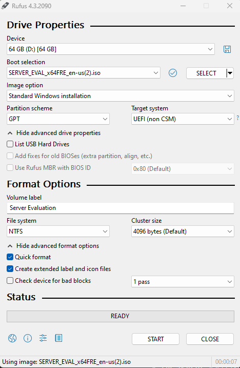
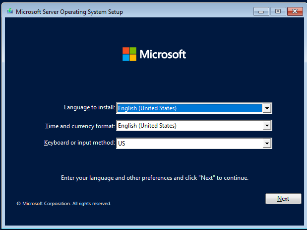
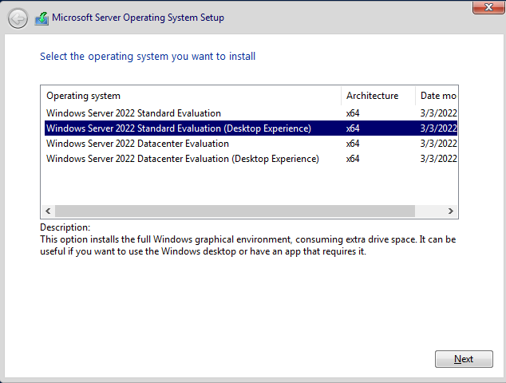
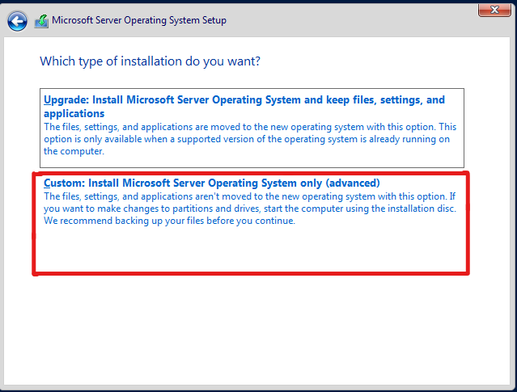
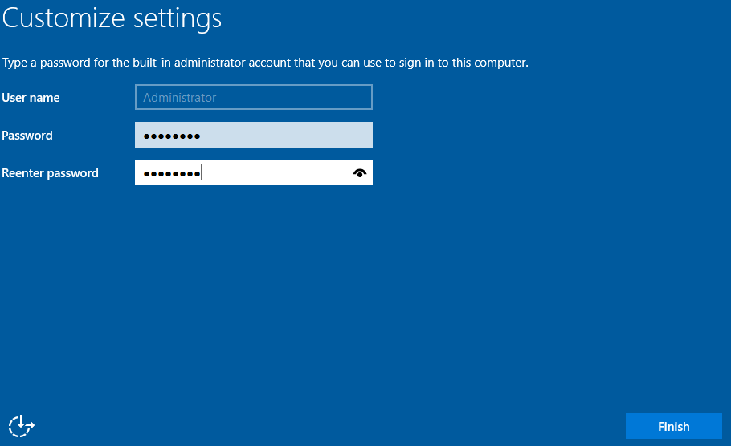

# :computer: Network Deployment 
The Network Deployment project, completed in the ITE 253 Network Management II course, is a comprehensive network infrastructure implemented using a Dell PowerEdge R6515 Rack Server. The project spans from initial setup to configurations, including efficient IP management, DNS setup, enhancing network reliability with a secondary domain controller, and integrating Active Directory. This approach embodies a holistic strategy for creating a secure, scalable, efficient network environment.
- [:computer: Network Deployment](#computer-network-deployment)
  - [Initial Setup](#initial-setup)
    - [1. Fresh Install](#1-fresh-install)
      - [ Hardware Utilized ](#-hardware-utilized-)
      - [ Steps to Create a Bootable USB ](#-steps-to-create-a-bootable-usb-)
      - [Steps to Install Standard Evaluation (Desktop Experience)](#steps-to-install-standard-evaluation-desktop-experience)
      - [ Driver Downloads ](#-driver-downloads-)
      - [ Benefits and Drawbacks of Using Windows Server ](#-benefits-and-drawbacks-of-using-windows-server-)
    - [2. Static Network Configuration](#2-static-network-configuration)
      - [Setting Static IP Configuration](#setting-static-ip-configuration)
      - [Directions for Configuration](#directions-for-configuration)
    - [3. DNS](#3-dns)
      - [Purpose of DNS](#purpose-of-dns)
      - [Setting up DNS](#setting-up-dns)
      - [How to Create Zones](#how-to-create-zones)
      - [Forward vs Reverse Lookup Zones](#forward-vs-reverse-lookup-zones)
    - [4. Secondary Domain Controller](#4-secondary-domain-controller)
  - [DHCP](#dhcp)
    - [1. Enabling DHCP](#1-enabling-dhcp)
    - [2. Failover](#2-failover)
  - [Active Directory](#active-directory)
    - [1. Enabling Active Directory](#1-enabling-active-directory)

---
## Initial Setup

This section provides detailed guidelines for a fresh installation on a Dell PowerEdge R6515 Rack Server, highlighting hardware specifications, the benefits and drawbacks of using Windows Server, and a step-by-step guide to creating a bootable USB. We also include links for downloading the necessary files.

### 1. Fresh Install

#### <ins> Hardware Utilized </ins>

**Model:** PowerEdge R6515 Rack Server

**Specifications:**
- **Processor:** AMD EPYC 7002 and 7003 series processors up to 64 cores
- **Memory:** Supports up to 2TB using 16 LRDIMM slots
- **Storage:** Flexible storage options with up to 10 x 2.5" SAS/SATA/NVMe options available
- **Management:** Integrated Dell Remote Access Controller (iDRAC) with Lifecycle Controller for advanced management

This server is designed for data centers needing an efficient and secure platform to handle demanding workloads. It offers a balance of performance, capacity, and manageability.

[Back to Table of Contents](#computer-network-deployment)

---

#### <ins> Steps to Create a Bootable USB </ins>

1. **Download the ISO File:** Obtain the Windows Server 2022 ISO file from Microsoft. [Microsoft's Windows Server 2022 page](https://info.microsoft.com/ww-landing-windows-server-2022.html)
2. **Prepare USB Drive:** Ensure the USB drive has at least 8GB of storage and is formatted to FAT32 (detailed below).
3. **Use Rufus or a Similar Tool:** Download and run Rufus or another bootable USB creation tool. [Rufus .exe download](https://rufus.ie/en/)
4. **Configure Rufus:**
   - **Device:** Select your USB drive.
   - **Boot selection:** Click SELECT and browse to your downloaded ISO file.
   - **Partition scheme:** Choose GPT for UEFI firmware.
   - **File system:** Select NTFS.
   - **Volume label:** Name your drive as desired.
   - **Click START and wait for the process to complete.**

_Figure 1: Using Rufus to prepare USB Drive_ 

[Back to Table of Contents](#computer-network-deployment)

---

#### <ins>Steps to Install Standard Evaluation (Desktop Experience)</ins>

Installing the Standard Evaluation with Desktop Experience for Windows Server involves a step-by-step process to ensure a smooth setup and configuration of a graphical user interface (GUI) environment. This version is ideal for those who prefer a graphical management interface over command-line tools.

1. **Start the Installation**: Boot your server from the installation media. On the "Windows Setup" page, select your language, time, currency, and input preferences, then click "Next".

2. **Install Now**: Click the "Install now" button to start the installation process.

3. **Select the Operating System**: Choose "Windows Server Standard Evaluation (Desktop Experience)" from the list of options. This option includes the Windows graphical environment.

4. **Accept the License Terms**: Check the box to accept the license terms and click "Next".

5. **Choose Installation Type**: Select "Custom: Install Windows only (advanced)" for a fresh installation.

6. **Select the Drive**: Choose the drive where you want to install Windows and click "Next". If needed, you can also format or partition your drive at this stage.

7. **Wait for Installation**: The installation process will begin. This will take some time and your computer may restart several times.

8. **Set Up User Accounts and Settings**: After installation, follow the prompts to configure your server, including setting up a password for the Administrator account, network settings, and any additional preferences.

  
 

_Figure 2: Completing the Installation Process_

[Back to Table of Contents](#computer-network-deployment)

---

#### <ins> Driver Downloads </ins>

For optimal performance and compatibility, ensure you have the latest drivers for your PowerEdge R6515 Rack Server. You can find and download the necessary drivers from Dell's official support page: [PowerEdge R6515 Drivers Download](https://www.dell.com/support/home/en-us/product-support/product/poweredge-r6515/drivers).

Remember, a successful installation not only relies on following these steps carefully but also on understanding the specifics of your hardware and software environment. Always refer to the official documentation for the most accurate and up-to-date information.

---

#### <ins> Benefits and Drawbacks of Using Windows Server </ins>

**Benefits:**
- **Integrated Management Tools:** Windows Server provides powerful management tools such as Windows Admin Center and PowerShell, simplifying server administration.
- **Security:** Enhanced security features like Windows Defender Advanced Threat Protection and encrypted virtual machines help protect against modern security threats.
- **Hybrid Capabilities:** Seamless hybrid operations with Azure, including Azure Arc for managing Windows Server deployments across hybrid environments.

**Drawbacks:**
- **Cost:** Windows Server licensing can be expensive, especially for organizations with multiple servers.
- **Resource Intensity:** It may require more resources (CPU, RAM) compared to some lightweight Linux distributions, potentially impacting server efficiency.
- **Compatibility:** Certain applications, especially open-source ones, may have compatibility issues or may not be optimized for Windows Server environments.

---

### 2. Static Network Configuration

The purpose of setting static network configurations in a network environment is to ensure that important devices such as servers, printers, and network infrastructure devices have consistent IP addresses. This consistency is crucial for network reliability, security, and ease of management, preventing issues like IP conflicts and making devices easily identifiable by their fixed IP addresses.

#### <ins>Setting Static IP Configuration</ins>

1. **IP Address**: This is the unique address assigned to each device on the network, allowing it to communicate with other devices. 
2. **Subnet Mask**: Defines the network portion and the host portion of the IP address, helping devices determine if other devices are on the same network.
3. **Default Gateway**: The IP address of the router or device that connects the local network to other networks, allowing devices to communicate outside their local network.
4. **DNS**: The Domain Name System (DNS) servers translate human-friendly domain names to IP addresses, facilitating internet browsing by allowing devices to find websites using domain names instead of IP addresses. 

[Back to Table of Contents](#computer-network-deployment)

---

#### <ins>Directions for Configuration</ins>

1. **Accessing Network Settings**: Navigate to the Control Panel, find the Network and Sharing Center, and click on 'Change adapter settings'. Right-click on the network connection you wish to configure, and select 'Properties'.

2. **Configuring IP Address and Subnet Mask**:
   - Within the Networking tab of the selected connection, scroll down to 'Internet Protocol Version 4 (TCP/IPv4)' and click on 'Properties'.
   - Select 'Use the following IP address' and enter your chosen IP address and Subnet Mask. 

3. **Setting Default Gateway and DNS**:
   - In the same window, enter the Default Gateway address provided by your network administrator.
   - Below the Default Gateway, select 'Use the following DNS server addresses' and input the preferred and alternate DNS server addresses.

*Figure 1: Accessing Network Settings*

*Figure 2: Configuring IP Address and Subnet Mask*

*Figure 3: Setting Default Gateway and DNS* 

[Back to Table of Contents](#computer-network-deployment)

---

### 3. DNS

The Domain Name System (DNS) plays a crucial role in how users interact with the internet, translating human-readable domain names into machine-readable IP addresses. This process allows users to access websites using familiar domain names instead of numeric IP addresses.

#### <ins>Purpose of DNS</ins>

DNS simplifies the process of accessing internet resources by allowing users to use easy-to-remember domain names. This system is akin to a phonebook for the internet, converting domain names (like `www.example.com`) into IP addresses that computers use to identify each other on the network.

#### <ins>Setting up DNS</ins>

Setting up a DNS server involves installing DNS server software on a server, configuring basic settings, and ensuring it responds to DNS queries.

1. **Installation**: On Windows Server, use the Server Manager to add the DNS role to your server. On Linux, install BIND (Berkeley Internet Name Domain) or another DNS server software package through your distribution's package manager.

2. **Basic Configuration**: Initially, configure your DNS server to answer queries for your domain. This includes specifying the primary domain for which the server will be authoritative.

*Figure 1: DNS Server Installation*

*Figure 2: Basic DNS Configuration*

[Back to Table of Contents](#computer-network-deployment)

---

#### <ins>How to Create Zones</ins>

DNS zones are used to manage domain names and their corresponding IP addresses within a particular segment of the DNS namespace.

1. **Primary Zone**: Create a primary zone to hold the authoritative DNS records for a domain. This can be done through the DNS server's management console or configuration files.

2. **Secondary Zone**: Optionally, set up a secondary zone for redundancy. This zone will be a read-only copy of the primary zone data.

3. **Directions**:
   - Navigate to your DNS server's management interface.
   - Choose to create a new zone, selecting between primary or secondary.
   - Enter the domain name for the zone and configure any additional settings such as zone file location or replication to other servers.

*Figure 3: Creating a DNS Zone*

[Back to Table of Contents](#computer-network-deployment)

---

#### <ins>Forward vs Reverse Lookup Zones</ins>

- **Forward Lookup Zones**: Translate domain names into IP addresses. This is the most common type of DNS query.
  
- **Reverse Lookup Zones**: Translate IP addresses back into domain names. These zones are helpful for logging, auditing, and troubleshooting purposes.

Creating both types of zones ensures that DNS can handle both forward and reverse queries, providing comprehensive domain name resolution services.

*Figure 4: Forward and Reverse Lookup Zones*

Please replace `path/to/your/image#.png` with the actual paths to your images. This expanded section aims to provide a clear understanding of DNS setup and management, including zone creation and the distinction between forward and reverse lookup zones.

[Back to Table of Contents](#computer-network-deployment)

---

### 4. Secondary Domain Controller
* Purpose of Secondary Domain Controller
* How to set it up
* DNS (Include directions for STANDALONE DNS)
  
## DHCP
### 1. Enabling DHCP
* Purpose of DHCP
* Scopes
* Exclusions
### 2. Failover
* Purpose of Failover
* How to setup DHCP failover including pictures and directions

## Active Directory
### 1. Enabling Active Directory
* Purpose of Active Directory
* Group Policy Objects (GPOs)
* Organizational Units 